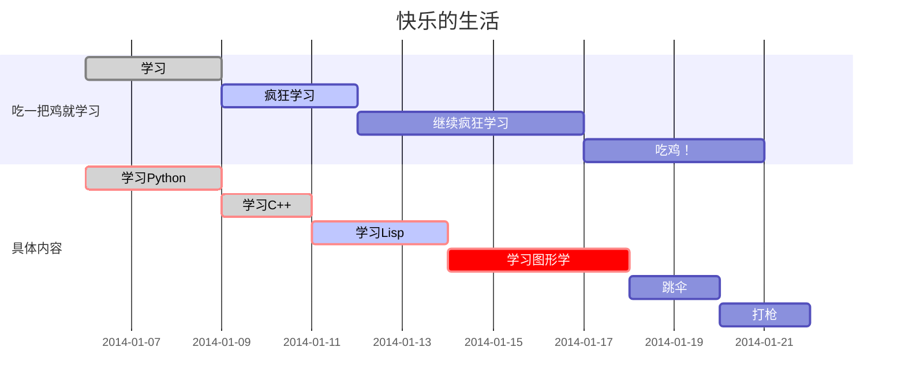
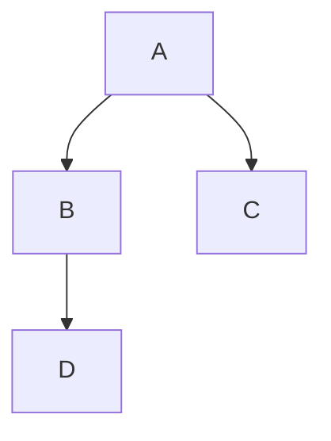
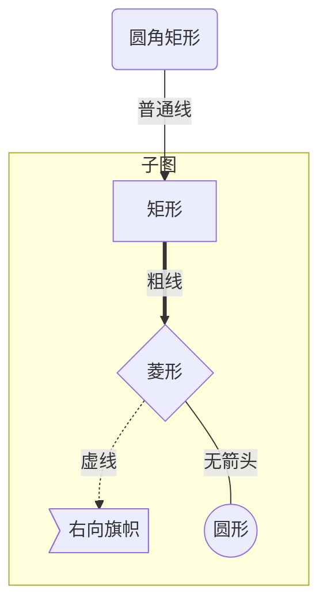
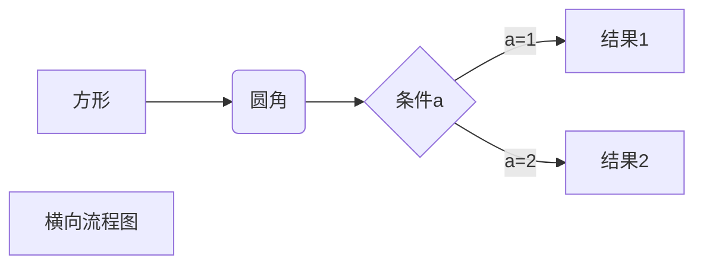
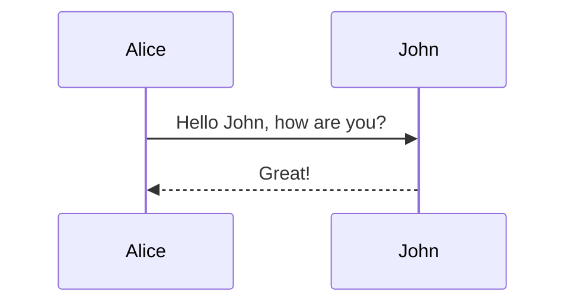
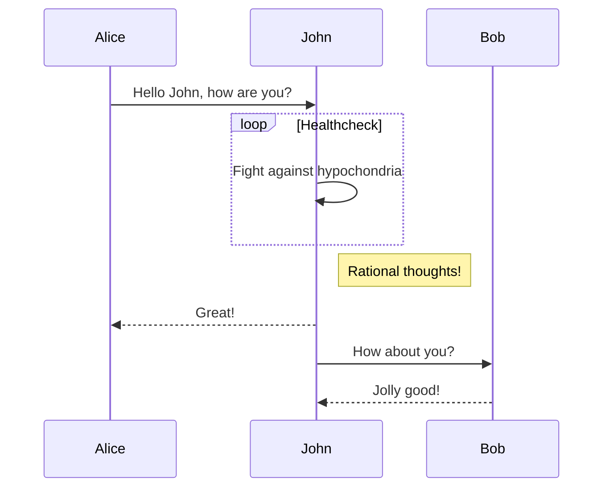
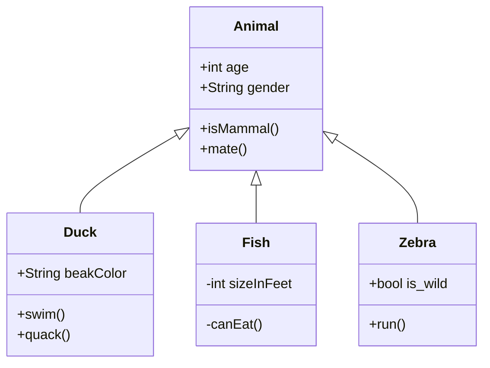
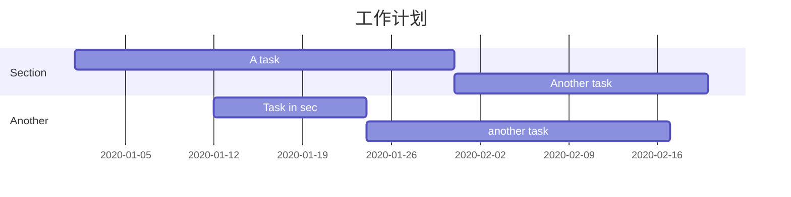
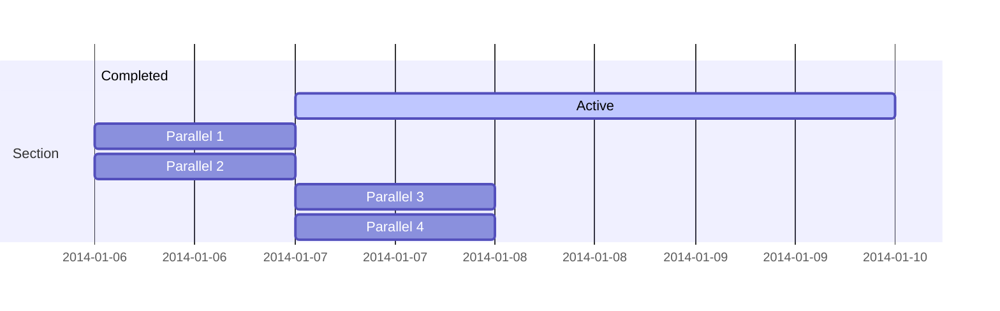
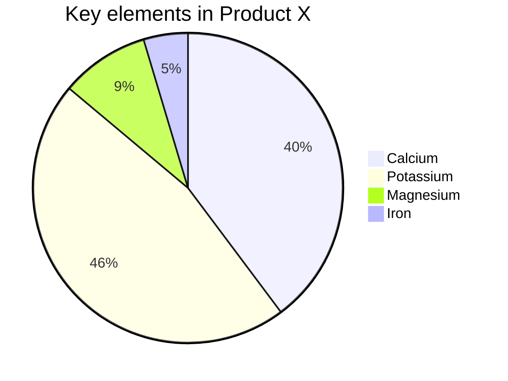

# Markdown Guide

虽然也写了几十万字的数字笔记了，但即使了Markdown这么简单的富文本规则我依然记不住，写一个方便看吧。


### Basic

标题共有5级，以`#`做标记。`### Name`这是三级标题。

换行是使用两个以上空格加上回车。或是在段落后面使用一个空行来表示重新开始一个段落。

Markdown 可以使用以下几种字体：

斜体：*左右两边用一个星号（或是下划线）括起来*  

粗体：**左右两边用两个星号（或是下划线）括起来**  

斜体加粗：***3个星号就是加粗斜体***  

高亮：==用两个等于号括起来==  

删除：~~用两个波浪号括起来~~

下划：<u>通过 HTML 的标签来实现：带下划线文本</u>

更复杂的字体可以使用CriticMarkup插件，例如下划线、批注、中划线。

脚注是对文本的补充说明。Markdown 脚注的格式如下`[^要注明的文本]`

创建脚注格式类似这样 [^RUNOOB]。
[^RUNOOB]: 菜鸟教程 -- 学的不仅是技术，更是梦想！！！

分隔线。
在一行中用三个以上的星号、减号、底线来建立一个分隔线，行内不能有其他东西。你也可以在星号或是减号中间插入空格。下面每种写法都可以建立分隔线：

``` markdown
***
* * *
*****
-  -  -
---------
```


### List

Markdown 支持有序列表和无序列表。

无序列表使用星号(*)、加号(+)或是减号(-)作为列表标记，这些标记后面要添加一个空格，然后再填写内容：
* 第一项
+ 第二项
- 第三项

有序列表使用数字并加上 . 号来表示，如：

1. 第一项
2. 第二项
3. 第三项

列表嵌套
列表嵌套只需在子列表中的选项前面添加四个空格或是一个`[TAB]`即可：
1. 第一项：
    - 第一项嵌套的第一个元素
    - 第一项嵌套的第二个元素
2. 第二项：
    - 第二项嵌套的第一个元素
    - 第二项嵌套的第二个元素


### Block

Markdown 区块引用是在段落开头使用 > 符号 ，然后后面紧跟一个空格符号：

> 区块引用
> 菜鸟教程
> 学的不仅是技术更是梦想

另外区块是可以嵌套的，一个 > 符号是最外层，两个 > 符号是第一层嵌套，以此类推：

> 最外层
> > 第一层嵌套
> > > 第二层嵌套

区块中可以使用列表，列表中也可以使用区块


### Code

行内代码只需在代码两端用1个重音符围起来即可。例如：在下文插入`print("hello, world")`

在所要展示的代码上下两行添加3个重音符[```]，重音符为ESC键里的那个
``` python
#代码在此显示，用两行3个重音符标记，  ```
print('hello,world'),
```
在第一行的```后面加上代码的格式，例如“c++、python、go”等可帮助计算机识别出代码的类型并进行相应的语法高亮显示。
``` c++
include <stdio.h>
int main(void)
{
    printf("Hello world\n");
}
```

C++代码示例
``` C++
#include "studio.h"
int main()
{
    printf("Hello, world!");
    return 0;
}
```

Java代码示例
```java
public class Example implements LoremIpsum {
	public static void main(String[] args) {
		if(args.length < 2) {
			System.out.println("Lorem ipsum dolor sit amet");
		}
	} // Obscura atque coniuge, per de coniunx
}
```


### Linking
链接使用方法如下：[百度](https://www.baidu.com)或者<www.baidu.com>

高级链接：我们可以通过变量来设置一个链接，变量赋值在文档末尾进行。

这个链接用 1 作为网址变量 [Google][1]
这个链接用 runoob 作为网址变量 [Runoob][runoob]
然后在文档的结尾为变量赋值（网址）

[1]: http://www.google.com/
[runoob]: http://www.runoob.com/

### 图片


```

```

### Table

Markdown 制作表格使用 | 来分隔不同的单元格，使用 - 来分隔表头和其他行。

语法格式如下：

|  表头   | 表头  |
|  ----  | ----  |
| 单元格  | 单元格 |
| 单元格  | 单元格 |


对齐方式：我们可以设置表格的对齐方式：
-: 设置内容和标题栏居右对齐。
:- 设置内容和标题栏居左对齐。
:-: 设置内容和标题栏居中对齐。

| 左对齐 | 右对齐 | 居中对齐 |
| :-----| ----: | :----: |
| 单元格 | 单元格 | 单元格 |
| 单元格 | 单元格 | 单元格 |


### 转义

Markdown 使用了很多特殊符号来表示特定的意义，如果需要显示特定的符号则需要使用转义字符，Markdown 使用反斜杠转义特殊字符：
**文本加粗** 
\*\* 正常显示星号 \*\*


### Equation

段落内嵌套公式：$E=mc^2$

单独一行大公式
$$E=mc^2$$

希腊字母（小写+大写）：

$$\alpha, \beta, \gamma, \delta, \epsilon, \zeta, \eta, \theta, \iota, \kappa, \lambda, \mu, \nu, \xi, \omicron, \pi, \rho, \sigma, \tau, \upsilon, \phi, \chi, \psi, \omega$$

$$\Alpha, \Beta, \Gamma, \Delta, \Epsilon, \Zeta, \Eta, \Theta, \Iota, \Kappa, \Lambda, \Mu, \Nu, \Xi, \Omicron, \Pi, \Rho, \Sigma, \Tau, \Upsilon, \Phi, \Chi, \Psi, \Omega$$

$\nabla \psi$


Binary Operations

Binary Relations

Arrows

Radical  

Square root: $\sqrt{x}$  

nth root: $\sqrt[n]{x}$

Sub & Supper


Fraction: $\frac{x}{y}, \tfrac{x}{y}, \dfrac{x}{y}$


Summation
$$\sum{}, \sum_{a}^{b}{xdx}, \textstyle\sum_{a}^{b}{xdx}, $$


Product
$$\prod{}, \prod_{a}^{b}{xdx}, \textstyle\prod_{a}^{b}{xdx}, $$


Coproduct
$$\coprod{}, \coprod_{a}^{b}{xdx}, \textstyle\coprod_{a}^{b}{xdx}, $$


Limits
$$\lim{x}, \lim_{x \to 0}{x}, \max_{x \to 0}{x}, \min_{x \to 0}{x},$$

Logarithms
$$\log_{a}{x}, \ln{x}, \lg{x},$$

Exponentials
$$\exp{x}$$


Derivative
$\dot{x}, \ddot{x}, {x}', {x}'', {x}^{(n)}, \partial t, \mathrm{d}t$


Integral
$$\int{xdx}, \int _{a} ^{b} {xdx}, \int\limits _{a} ^{b} {xdx}$$

Double integral
$$\iint{xdx}, \iint _{a} ^{b} {xdx}, \iint\limits _{a} ^{b} {xdx}$$

Triple integral 
$$\iiint{xdx}, \iiint _{a} ^{b} {xdx}, \iiint\limits _{a} ^{b} {xdx}$$

Closed line or path integral
$$\oint{xdx}, \oiint _{a} ^{b} {xdx}, \oiiint\limits _{a} ^{b} {xdx}$$


$$
\begin{matrix}
    a & b \\ c & d
\end{matrix} 
$$
$$
\begin{bmatrix}
    a & b \\ c & d
\end{bmatrix}
$$
$$
\begin{vmatrix}
    a & b \\ c & d
\end{vmatrix}
$$
$$
\begin{pmatrix}
    a & b \\ c & d
\end{pmatrix}
$$
$$
\begin{Vmatrix}
    a & b \\ c & d
\end{Vmatrix}
$$
$$
\begin{Bmatrix}
    a & b \\ c & d
\end{Bmatrix}
$$


### HTML
支持的 HTML 元素，不在 Markdown 涵盖范围之内的标签，都可以直接在文档里面用 HTML 撰写。目前支持的 HTML 元素有：{kbd b i em sup sub br}等 ，如：使用 <kbd>Ctrl</kbd>+<kbd>Alt</kbd>+<kbd>Del</kbd> 重启电脑


### Gannt

```sequence
李雷 -> 韩梅梅: Hello 梅梅, How are you?
Note right of 韩梅梅: 韩梅梅心想
韩梅梅 --> 李雷: I'm fine, thanks, and you?
```

```flow
st=>start: 闹钟响起
op=>operation: 与床板分离
cond=>condition: 分离成功?
e=>end: 快乐的一天

st->op->cond
cond(yes)->e
cond(no)->op
```




流程图
语法解释：graph 关键字就是声明一张流程图，TD 表示的是方向，这里的含义是 Top-Down 由上至下。







时序图
语法解释：->> 代表实线箭头，-->> 则代表虚线。





状态图
语法解释：[*] 表示开始或者结束，如果在箭头右边则表示结束。


类图
语法解释：<|-- 表示继承，+ 表示 public，- 表示 private，学过 Java 的应该都知道。



甘特图
甘特图一般用来表示项目的计划排期，目前在工作中经常会用到。  
语法也非常简单，从上到下依次是图片标题、日期格式、项目、项目细分的任务。





饼图
饼图使用 pie 表示，标题下面分别是区域名称及其百分比。pie



 


<script type="text/javascript" id="MathJax-script" async src="https://cdnjs.cloudflare.com/ajax/libs/mathjax/3.0.0/es5/tex-mml-chtml.js">
</script>
<script>
MathJax = {
  tex: {
    inlineMath: [['$', '$'], ['\\(', '\\)']]
  }
};
</script>
<script id="MathJax-script" async src="https://cdn.jsdelivr.net/npm/mathjax@3/es5/tex-chtml.js">
</script>

